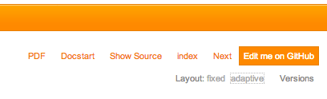

Advanced Markup
===============

.. contents:: Overview
    :local:


Title, copyright and version
----------------------------

A valid Sphinx project for an extension manual should contain a configuration file :file:`Settings.yml` next to the main
document :file:`Index.rst`. This file is your key to override default settings from the real Sphinx configuration file
:file:`conf.py` which is not part of your project (because it contains settings related to the build environment on
http://docs.typo3.org). Instead, this YAML configuration file lets you define project options.

This extension takes care of loading options from :file:`Settings.yml` as well, thus ensuring a smooth experience when
working locally on your extension manuals before their automatic deployment to http://docs.typo3.org.

A basic :file:`Settings.yml` file should define a few basic project information:

.. code-block:: yaml
	:linenos:

	conf.py:
	  copyright: 2013
	  project: Sphinx Python Documentation Generator and Viewer
	  version: 1.2
	  release: 1.2.0

project
	The documented project's name.

copyright
	A copyright statement in the style ``2013, Author Name``.

	.. tip::
		Within TYPO3 official documentation, we usually only show the year(s) of copyright, e.g., ``2013``
		or ``2010-2013``.

version
	The major project version, used as the replacement for ``|version|``. For example, for the TYPO3
	documentation, this may be something like ``6.2``.

release
	The full project version, used as the replacement for ``|release|``. For example, for the TYPO3 documentation, this
	may be something like ``6.2.0rc1``.

	If you don't need the separation provided between ``version`` and ``release``, just set them both to
	the same value.

	.. tip::
		This is of course up to the extension's author to decide on a version numbering scheme but best practices follow
		the same rules as for TYPO3 core and do not introduce breaking changes or new features in patch-release
		versions (when the last of the three digits changes).

		As extension authors are very likely to forget to update the version prior to uploading their extension to TER,
		the rendering engine on http://docs.typo3.org automatically overrides the *version* and *release* parameters
		to the actual version as seen on TER.


.. _docs-typo3-org-pdf:

PDF rendering
^^^^^^^^^^^^^

The PDF of your documentation is rendered using the LaTeX builder from Sphinx (see `Rendering PDF from reStructuredText <http://docs.typo3.org/typo3cms/extensions/sphinx/AdvancedUsersManual/RenderingPdf/Index.html>`_ if needed)
and should be explicitly activated for your extension. To do so, open file :file:`Settings.yml` (at the root of your
documentation folder) and make sure it contains following configuration options (lines 6 to 15):

.. code-block:: yaml
	:linenos:

	conf.py:
	  copyright: 2013
	  project: Sphinx Python Documentation Generator and Viewer
	  version: 1.1
	  release: 1.1.0
	  latex_documents:
	  - - Index
	    - sphinx.tex
	    - Sphinx Python Documentation Generator and Viewer
	    - Xavier Perseguers
	    - manual
	  latex_elements:
	    papersize: a4paper
	    pointsize: 10pt
	    preamble: \usepackage{typo3}

Lines 7 to 11 define options for value ``latex_documents`` which determines how to group the document tree into LaTeX
source files. This is a list of tuples: ``startdocname``, ``targetname``, ``title``, ``author``, ``documentclass``, where
the items are:

startdocname
	Document name that is the "root" of the LaTeX files. All documents referenced by it in TOC trees will be included
	in the LaTeX file too.

	.. warning::
		Always use ``Index`` here.

targetname
	File name of the LaTeX file in the output directory.

	.. warning::
		Always use your extension key followed by ``.tex`` here.

title
	LaTeX document title. This is inserted as LaTeX markup, so special characters like a backslash or ampersand must be
	represented by the proper LaTeX commands if they are to be inserted literally.

author
	Author for the LaTeX document. The same LaTeX markup caveat as for *title* applies. Use ``\and`` to separate
	multiple authors, as in: ``'John \and Sarah'``.

documentclass
	Normally, one of ``manual`` or ``howto`` (provided by Sphinx).

	.. tip::
		To keep TYPO3 branding, you should always use ``manual`` here.

Lines 12 to 15 should be kept as-this. Line 15 is actually the "trigger" for PDF rendering.

When activated, your PDF gets automatically rendered on http://docs.typo3.org under
:file:`http://docs.typo3.org/typo3cms/extensions/{extension-key}/_pdf/`. E.g.,
http://docs.typo3.org/typo3cms/extensions/sphinx/_pdf/.

Please read chapter :ref:`customizing-rendering` for further information on LaTeX configuration options.


.. _docs-typo3-org-multilingual:

Multilingual documentation
--------------------------

.. index::
	single: Multilingual manual

Multilingual exension manuals are supported by both this extension and http://docs.typo3.org. If you want to translate
your documentation, kickstart a new Sphinx project (incl. :file:`Settings.yml`) within directory
:file:`Documentation/Localization.{locale}`.

.. tip::
	You may reuse assets such as :file:`Includes.txt` or images from the main documentation under
	directory :file:`Documentation` but not the other way around, so you cannot reuse assets from a
	translated manual within the main (English) manual.


Locales
^^^^^^^

.. index::
	single: Locales

Unless for the few prefixes which are already "locales", http://docs.typo3.org expects a locale and not a language code
to be used; so make sure to extend the prefix accordingly. E.g., a French documentation (prefix ``fr``) should be
extended either to ``fr_FR`` (French France) or ``fr_CA`` (French Canada). See our list of suggestions below.

Your translated exension manual will get rendered to http://docs.typo3.org/typo3cms/extensions/sphinx/fr-fr/ (HTML) and
http://docs.typo3.org/typo3cms/extensions/sphinx/fr-fr/_pdf/ (PDF).

.. caution::
	Files and URIs are generated lower-case and with dashes instead of underscores. This means that a documentation
	with locale ``fr_FR`` will be accessible using ``fr-fr`` instead.

The list of supported languages for Sphinx is:

======  ======================== ================
Prefix  Name                     Suggested Locale
======  ======================== ================
bn      Bengali                  bn_BD
ca      Catalan                  ca_ES
cs      Czech                    cs_CZ
da      Danish                   da_DK
de      German                   de_DE
es      Spanish                  es_ES
et      Estonian                 et_EE
eu      Basque                   eu_ES
fa      Iranian                  fa_IR
fi      Finnish                  fi_FI
fr      French                   fr_FR, fr_CA
hr      Croatian                 hr_HR
hu      Hungarian                hu_HU
id      Indonesian               id_ID
it      Italian                  it_IT
ja      Japanese                 ja_JP
ko      Korean                   ko_KR
lt      Lithuanian               lt_LT
lv      Latvian                  lv_LV
mk      Macedonian               mk_MK
nb_NO   Norwegian Bokmal         nb_NO
ne      Nepali                   ne_NP
nl      Dutch                    nl_NL
pl      Polish                   pl_PL
pt_BR   Brazilian Portuguese     pt_BR
ru      Russian                  ru_RU
si      Sinhala                  si_LK
sk      Slovak                   sk_SK
sl      Slovenian                sl_SI
sv      Swedish                  sv_SE
tr      Turkish                  tr_TR
uk_UA   Ukrainian                uk_UA
zh_CN   Simplified Chinese       zh_CN
zh_TW   Traditional Chinese      zh_TW
======  ======================== ================


Best practices
^^^^^^^^^^^^^^

When translating a documentation, you may be tempted to translate everything, including directory and file names.
Although this sounds reasonable at first sight, we advise you **not** to do so.

In fact, best practices show that if you keep the original directory and file names, you let readers quickly switch back
and forth from a chapter to its translation on http://docs.typo3.org because the language switch (currently hidden in the
"version" dropdown) simply searches for the same relative URI in the translated documentation. If it finds the *same*
document, it will go to the very same chapter (but translated!) otherwise it will go to the start page.

This is depicted by the following figure. The second navigation bar (French documentation) shows that directory and file
names have been preserved. It is thus possible to switch from the original, in English, to the French translation by
prefixing the URI segment ``fr-fr/``. In the third navigation bar however, the directory and files names have been
translated as well, making it impossible to match chapters with their translated counterparts:

.. image:: Images/translated-uri-segments.png
	:alt: Translating URI segments


.. _docs-typo3-org-edit-github:

Edit manual on GitHub
^^^^^^^^^^^^^^^^^^^^^

In case your extension is hosted on GitHub, you may configure the manual so that it gets easily editable when published
on http://docs.typo3.org:



To make this link visible, you should add the relative URI of your GitHub project repository and the branch you are
using (typically "master") to the configuration file :file:`Documentation/Settings.yml`:

.. code-block:: yaml
	:linenos:
	:emphasize-lines: 6-8

	conf.py:
	  copyright: 2013-2014
	  project: Sphinx Python Documentation Generator and Viewer
	  version: 2.1
	  release: 2.1.0
	  html_theme_options:
	    github_repository: xperseguers/t3ext-sphinx
	    github_branch: master

where ``xperseguers/t3ext-sphinx`` is the relative URI in ``http://github.com/xperseguers/t3ext-sphinx``.

.. note::
	Every official TYPO3 manual, guide and reference is using this option, making it a breeze to contribute if you
	spot a typo or wish something got rephrased or better explained.


.. _other-semantic-markup:

Other Semantic Markup
---------------------

The following roles don't do anything special except formatting the text
in a different style:

.. rst:role:: abbr

   An abbreviation.  If the role content contains a parenthesized explanation,
   it will be treated specially: it will be shown in a tool-tip in HTML, and
   output only once in LaTeX.

   Example: ``:abbr:`LIFO (last-in, first-out)```: :abbr:`LIFO (last-in, first-out)`.

.. rst:role:: command

   The name of an OS-level command, such as ``rm``.

.. rst:role:: file

   The name of a file or directory.  Within the contents, you can use curly
   braces to indicate a "variable" part, for example::

      ... is installed in :file:`/usr/lib/python2.{x}/site-packages` ...

   In the built documentation, the ``x`` will be displayed differently to
   indicate that it is to be replaced by the Python minor version.

.. rst:role:: guilabel

   Labels presented as part of an interactive user interface should be marked
   using ``guilabel``.  Any label used in the interface should be marked with
   this role, including button labels, window titles, field names, menu and
   menu selection names, and even values in selection lists.

   An accelerator key for the GUI label can be included using an ampersand;
   this will be stripped and displayed underlined in the output (example:
   ``:guilabel:`&Cancel```).  To include a literal ampersand, double it.

.. rst:role:: kbd

   Mark a sequence of keystrokes.  What form the key sequence takes may depend
   on platform- or application-specific conventions.  When there are no relevant
   conventions, the names of modifier keys should be spelled out, to improve
   accessibility for new users and non-native speakers.  For example, an
   *xemacs* key sequence may be marked like ``:kbd:`C-x C-f```, but without
   reference to a specific application or platform, the same sequence should be
   marked as ``:kbd:`Control-x Control-f```.

.. rst:role:: menuselection

   Menu selections should be marked using the ``menuselection`` role.  This is
   used to mark a complete sequence of menu selections, including selecting
   submenus and choosing a specific operation, or any subsequence of such a
   sequence.  The names of individual selections should be separated by
   ``-->``.

   For example, to mark the selection "Start > Programs", use this markup::

      :menuselection:`Start --> Programs`

   When including a selection that includes some trailing indicator, such as the
   ellipsis some operating systems use to indicate that the command opens a
   dialog, the indicator should be omitted from the selection name.

   ``menuselection`` also supports ampersand accelerators just like
   :rst:role:`guilabel`.

.. rst:role:: program

   The name of an executable program.  This may differ from the file name for
   the executable for some platforms.  In particular, the ``.exe`` (or other)
   extension should be omitted for Windows programs.

The following roles generate external links:

.. rst:role:: rfc

   A reference to an Internet Request for Comments.  This generates appropriate
   index entries. The text "RFC *number*\ " is generated; in the HTML output,
   this text is a hyperlink to an online copy of the specified RFC.  You can
   link to a specific section by saying ``:rfc:`number#anchor```.
